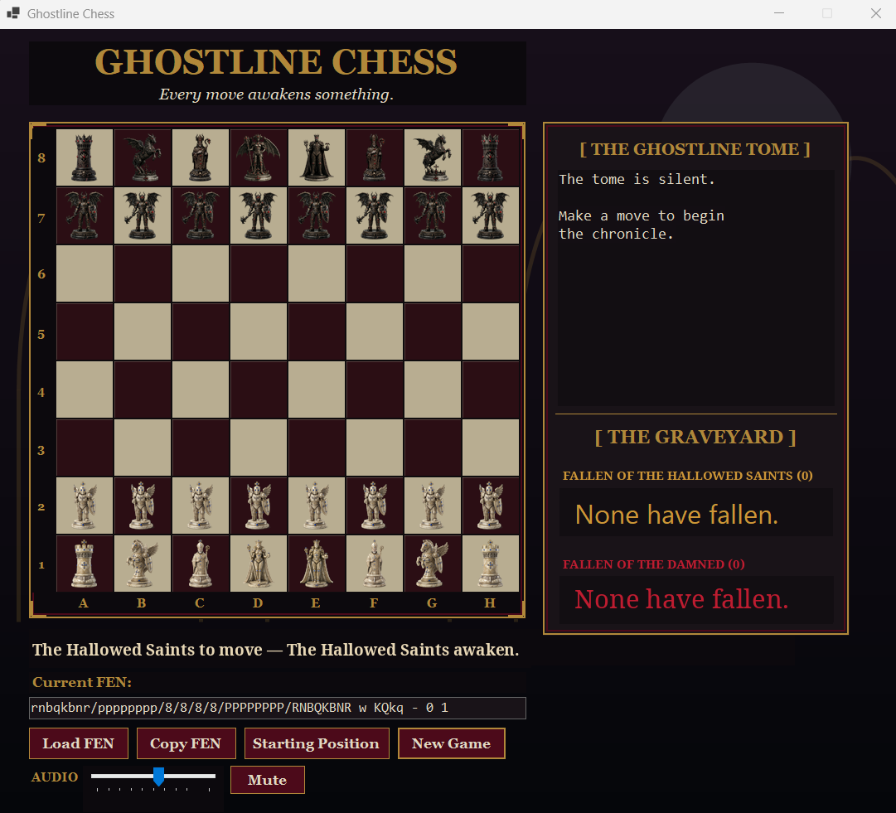

# Ghostline Chess

[](https://github.com/miker1979/Ghostline-Chess/actions/workflows/dotnet-build.yml)

**Every move awakens something.**

Ghostline Chess is a horror-themed Windows chess game built with C# and Windows Forms. The **Hallowed Saints** and **Damned Souls** fight across a gothic board while the Ghostline Tome records each move and the Graveyard displays captured pieces.



## Current GitHub source

The current source contains the completed chess-engine, gothic-interface, and v7 layered-audio milestones:

- Complete legal movement and captures
- Check and checkmate detection with a crimson king warning
- Kingside and queenside castling, including castling safety validation
- En passant and all four promotion choices
- Algebraic move history in the Ghostline Tome
- Captured-piece tracking in the Graveyard
- FEN import, export, validation, and move counters
- Stalemate and insufficient-material draws
- Threefold-repetition and fifty-move-rule draws
- Custom Hallowed Saints and Damned Souls artwork
- Continuous gothic background suite
- Randomized environmental creaks with no immediate repeat
- Layered playback so ambience continues beneath board effects
- Twenty-four faction-and-piece move and capture cues
- Deferred audio-device startup to reduce launch-freeze risk

The v7 audio routing is playable and stable. Individual sounds remain subject to track-by-track curation as development continues.

## Requirements

- Windows 10 or Windows 11
- Visual Studio 2026 with the **.NET desktop development** workload, or the .NET 10 SDK

## Build and run

```powershell
dotnet restore GhostlineChess.slnx
dotnet build GhostlineChess.slnx --configuration Release --no-restore
dotnet run --project GhostlineChess/GhostlineChess.csproj
```

Every push and pull request is also compiled on a Windows GitHub Actions runner using .NET 10.

## Windows release

The existing packaged Windows release remains available from the [Releases page](https://github.com/miker1979/Ghostline-Chess/releases). The public download is still the early v1.0.0 prerelease while the newer engine and audio work is prepared for the next packaged build.

## Project status

The core chess-engine and first layered-audio passes are complete. Current development focuses on sound-by-sound curation, stronger visual feedback, release packaging, and future single-player features.

Built by Michael Robinson for Haunted Echoes Studios.
